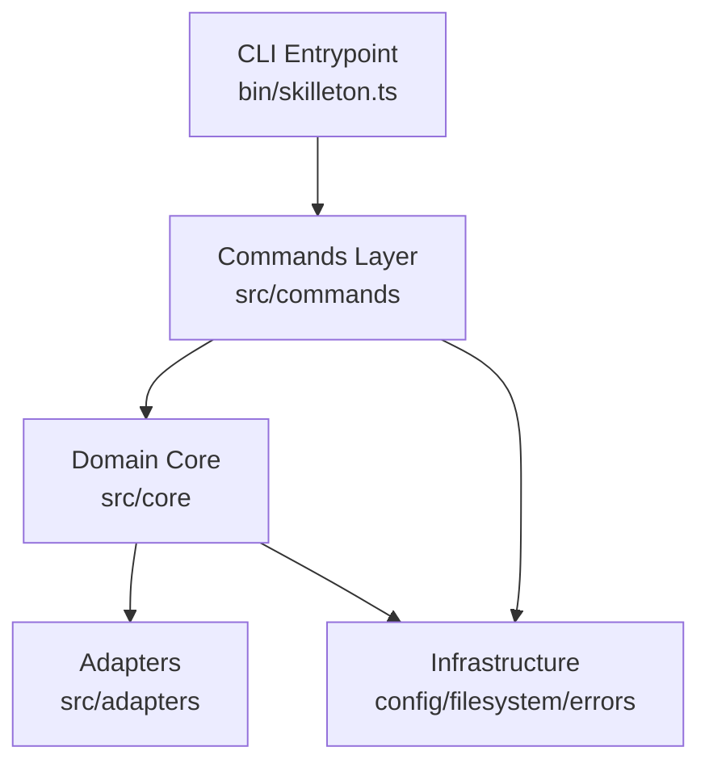
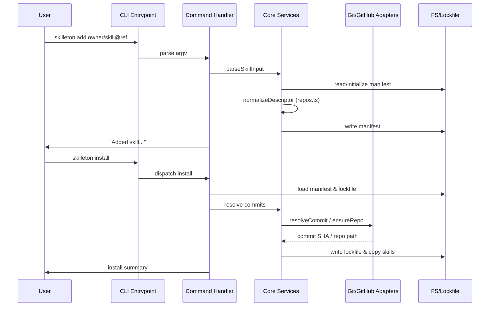
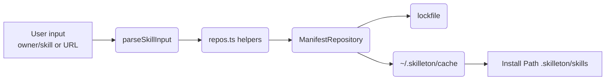

# Skilleton Architecture

Skilleton follows a layered, testable architecture grounded in ports/adapters.

## Layering

1. **CLI (bin/skilleton.ts)**: Parses process arguments, delegates to command handlers, and formats output.
2. **Application Services (src/commands)**: One per command (`add`, `install`, `update`, `list`, `audit`). Services orchestrate use cases, operate on repositories, and return rich result objects.
3. **Domain Core (src/core)**:
   - `parse.ts`: Input normalization from `<owner>/<skill>[@ref]` or any repo URL into structured `SkillDescriptor` objects.
   - `repos.ts`: Repository helpers that normalize/validate URLs, derive cache keys, and enforce deterministic manifests.
   - `validate.ts`: JSON Schema validation using AJV, enforcing manifest invariants.
   - `resolve.ts`: Commit resolution, SHA lookups (GitHub today, other VCS hosts later), SKILL.md guarantees.
   - `install.ts`: Filesystem + git orchestration, cache management, extraction, and idempotent installs.
4. **Adapters (src/adapters)**:
   - `github.ts`: REST wrapper using `fetch` with token/env injection.
   - `git.ts`: `execa`-based git commands (clone, fetch, checkout).
   - `fs.ts`: Filesystem helpers (ensureDir, writeJson, readJson, symlinks).
5. **Infrastructure**: Shared utilities, config resolution, logging, and error types.

## Data Flow

This diagram highlights that manifest writes always pass through `normalizeDescriptor`, ensuring every repo field is stored as a normalized URL (e.g., `https://github.com/owner/skills`), regardless of whether the user provided a slug or full URL.

## Repository & Caching Strategy

- User inputs can be slugs (`owner/skill`) or full URLs (GitHub, GitLab, Bitbucket, self-hosted). `src/core/repos.ts` normalizes everything into HTTPS URLs.
- Cache key = sanitized, normalized repo URL (e.g., `https___github_com_owner_skills`).
- Cache root: `~/.skilleton/cache/<cacheKey>`.
- Clone once per repo, then `git fetch --prune --force` on subsequent installs.
- Extract skill directories via worktrees + filesystem copy, guaranteeing deterministic installs.
- Idempotent installs: target skill folder is removed before copy; lockfile commit pins guarantee reproducibility.

## Validation

- `skilleton.schema.json` enforces manifest structure and now accepts either URLs or `owner/repo` slugs for `repo` fields.
- Additional runtime checks guarantee unique names and consistent repo/path combos.
- `repos.ts` ensures all manifests + lockfiles serialize normalized URLs, preventing prompt-injection via repo aliasing.
- Errors bubble up as typed exceptions with user-friendly messages.

## Testing Strategy

- Unit tests for each core module (parse, validate, resolve, install) under `tests/`.
- Use Jest mocks for filesystem, git, and network interactions.
- CLI integration tests cover command surfaces with fixture manifests.

## Future-Proofing

- Strict interfaces allow future expansion (custom registries, plugins) without reworking internals.
- Modular adapters make it easy to add telemetry-free analytics later if desired.
